[[GATE]]
# GATE 2027 — Daily Study

---

## Workday

```mermaid
gantt
    title Workday Schedule
    dateFormat HH:mm
    axisFormat %H:%M

    section Morning
    Wake & Freshen Up          :05:30, 30m
    Study Block 1 (New Topic)  :06:00, 150m
    Breakfast Break            :08:30, 30m
    Study Block 2 (Practice)   :09:00, 150m
    Wind Down / Commute        :11:30, 30m

    section Blocked (Job)
    Buffer (Pre-Job)           :crit, 12:00, 60m
    Job                        :crit, 13:00, 540m
    Buffer (Post-Job)          :crit, 22:00, 60m

    section Night
    Light Revision (optional)  :23:00, 30m
    Sleep Begins               :23:30, 60m
```

**~5 hours of solid study** (Study Block 1 + 2). The 11–11:30 PM slot is optional light review only — no new topics.

---

## Off-Day

```mermaid
gantt
    title Off-Day Schedule
    dateFormat HH:mm
    axisFormat %H:%M

    section Morning
    Wake & Breakfast            :07:00, 60m
    Study Block (Weak Topics)   :08:00, 180m
    Break                       :11:00, 30m

    section Midday
    Practice / PYQs             :11:30, 120m
    Lunch + Real Rest           :13:30, 90m

    section Afternoon
    Study Block / Mock Test     :15:00, 150m
    Free Time                   :17:30, 210m
```

**~7.5 hours of study**, still leaving your evening (5:30 PM onward) free.